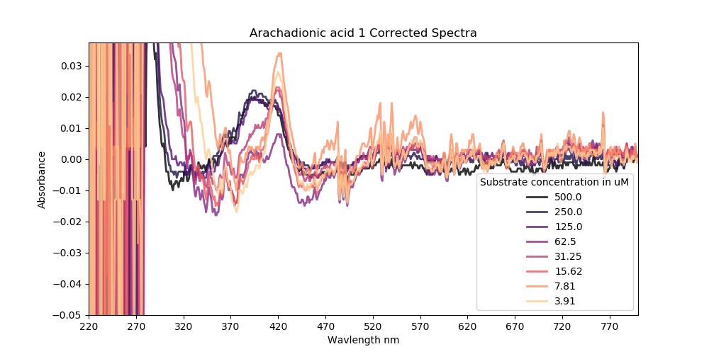
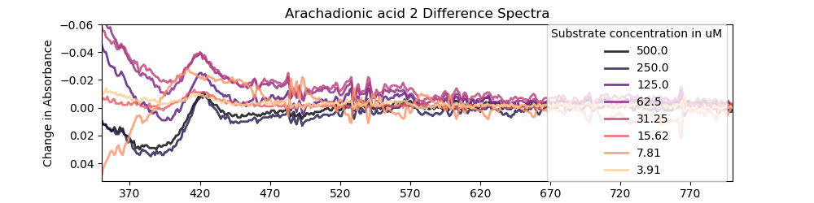
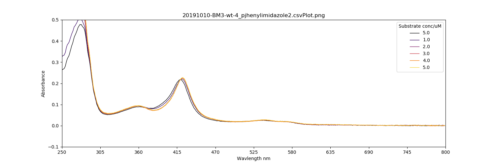
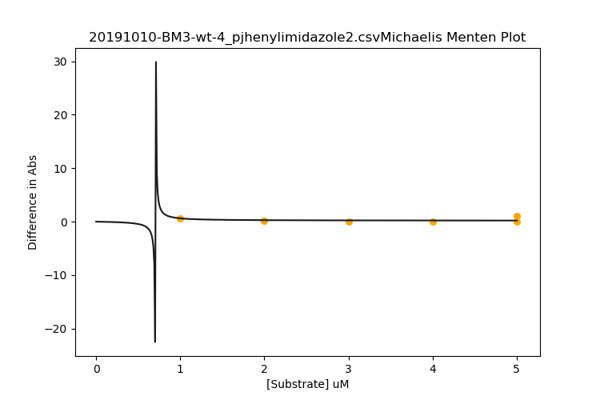

### 20191011
Did another plate assay with the following layout:


Using BM3 Heme WT from [this purification]()
I made a working stock in 100 mM KPi pH7 and took a [Spec trace](20191009_bm3_plateWorkingStockConcCheck.csv) of it.
The concentration I made was ```2.388503µM``` which is probably a little low. I should shoot for more like 5-10 µM I think. At least this gives me an opportunity to work with noisy data.

Here's the trace:


Though the master stock solutions I made didn't have any dead volume, so the 3rd repeat of each compound is probably fucked.

Here's the data:
[data](20191010.CSV)

I also did a set of [titrations](titrations) with the same protein and substrate stocks for comparison.

| Raw Spec                                                | Difference Spec                                          | Michaelis Menten                                       |
|:--------------------------------------------------------|:---------------------------------------------------------|:-------------------------------------------------------|
|               |               |               |
|  |  |  |
|  |  |  |
|  |  |  |
|        |        |        |
|        |        |        |
|        |        |        |
|      |      |      |
|      |      |      |
|      |      |      |
|                |                |                |
|                |                |                |
|                |                |                |
|  |  |  |
|  |  |  |

|                     |       vmax |              Km |            R^2 |
|:--------------------|-----------:|----------------:|---------------:|
| DMSO 1              | 0.00797792 | 46340.4         | -inf           |
| Arachadionic acid 1 | 1.17194    |    55.1664      |    0.972835    |
| Arachadionic acid 2 | 1.039      |    46.2024      |    0.861965    |
| Arachadionic acid 3 | 0.565874   |     5.35875     |    0.0976456   |
| Lauric acid 1       | 0.477273   |     5.0901e-20  |   -2.22045e-16 |
| Lauric acid 2       | 0.913282   |    35.4883      |    0.49316     |
| Lauric acid 3       | 0.403846   |     5.06614e-14 |   -1.77636e-15 |
| Palmitic acid 1     | 0.5        |     5.80602e-28 |    1.11022e-16 |
| Palmitic acid 2     | 0.4        |     4.22308e-18 |    0           |
| Palmitic acid 3     | 0.522727   |     2.38107e-14 |   -4.88498e-15 |
| SDS 1               | 0.90486    |    25.1203      |    0.627434    |
| SDS 2               | 0.66703    |    16.17        |    0.223547    |
| SDS 3               | 0.968986   |    45.0581      |    0.453922    |
| 4-PhenylImidazole 1 | 0.397727   |     2.0405e-18  |    0           |
| 4-PhenylImidazole 2 | 0.458333   |     1.731e-22   |   -2.22045e-16 |


I'll have to re-do this assay with a higher concentration of protein, somewhere in the 10 µM range I think. I've also noticed a thick concave miniscus on the surface of the protein-containing wells, which may lead to well-well variability that would depend on how accurately the platereader places the beam. I could probably find out how accurately by doing repeats of the same plate, assuming that nothing else changes.

Maybe I can reduce the surface tension or something.

I Ploted the [Titration data](titrations):

|                                  | Raw Spec                                                 | Difference Spec                                                     | Michaelis Menten                                                         |
|:---------------------------------|:---------------------------------------------------------|:--------------------------------------------------------------------|:-------------------------------------------------------------------------|
| 20191001_BM3WT_Arachadonic_1.csv |  |  |  |
| 20191010-BM3-wt-ARACHADONICACID1_saharadidntdoanyofit3.csv |  |  |  |
| 20191010-BM3-wt-4_lauric_acid1.csv |  |  |  |
| 20191010-BM3-wt-4_lauric_acid2.csv |  |  |  |
| 20191010-BM3-wt-4_palmOH1.csv |  |  |  |
| 20191010-BM3-wt-4_palmOH2.csv |  |  |  |
| 20191010-BM3-wt-4_sds1.csv |  |  |  |
| 20191010-BM3-wt-4_sds2.csv |  |  |  |
| 20191010-BM3-wt-4_sds3.csv |  |  |  |
| 20191010-BM3-wt-4_pjhenylimidazole1.csv |  |  |  |
| 20191010-BM3-wt-4_pjhenylimidazole2.csv |  |  |  |
| 20191010-BM3-wt-4_pjhenylimidazole3.csv |  |  |  |
| 20191010-BM3-wt-4_pjhenylimidazole4.csv |  |  |  |
