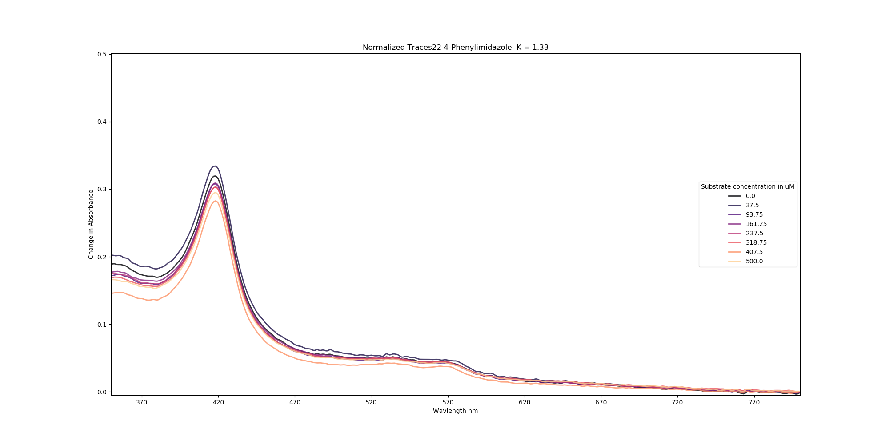
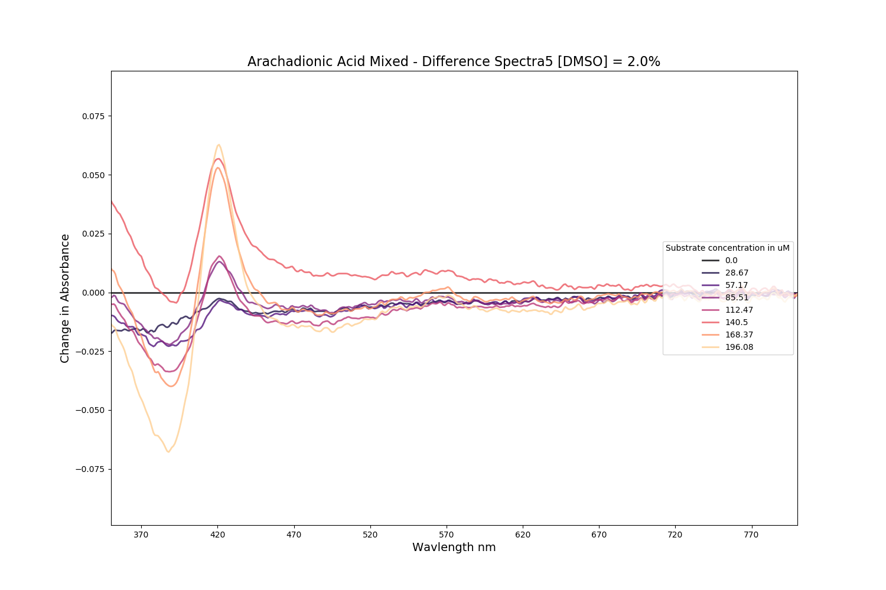

## Echo Testing

### 20191022

I want to revisit the Echo to see if I can dispense my compounds with it. I have
flexible access to Ross King's Echo, and when he leaves, then I'll try to use
the Cai or FutureBio hub..? In this test I want to know:
1. Is the apparent lack of mixing that I thought I saw last time I tried the
   Echo with this assay inherent to the Echo?
2. What spread of compound concentrations should I use?

To answer **1** I'll test my usual array of substrates with what BM3 WT Heme
domain I have. Those being:
1. Arachadionic acid
2. Palmitic acid
3. Lauric acid
4. 4-Phenylimidazole

I have lots of treated Thermo plates about, so if I have enough protein and
compound I may as well test that too, if it's resluts are much different from
the non-treated plates then that tells me that the surface might be adsorbing
the compounds (in the past the protein hasn't behaved differently in the two
plate types.)

To answer **2** I made a formula thateither bunches up the points at one end or
spreads them evenly:

x = [x0 ... xn]^k * 500 µM

where xn = 1, [x0 ... xn] are linearly spaced and k is beween 1 and 4. This is
how I implemented it:

```python
 x=(np.linspace(0,1,8)**k)*500
```

I made a tool that generates the transfer xml for the echo from a pandas dataframe in [EchoXMLGenerator.py](EchoXMLGenerator.py) and used that in a [script](ExperimentGenerator.py) where the experiment transfer sheet was generated. Here's a section of the main loop:

```python
sourcewells = ['A1']*4 + ['B1']*4 + ['C1']*4 + ['D1']*4
columns = np.arange(1,16)
k_values = np.linspace(1,2,4).tolist()*4
```
I'm making iterables with the four source wells that I want to use, and for each
source well/compound, I'm doing 4 different compound distributions. The K values
that this generates are

```
[1.0, 1.3333333333333333, 1.6666666666666665, 2.0]
```

I'm not sure why I've chosen 2 as the limit. Here's the output so far. [echo.xml](echo.xml).

*********

### 20191023

I realised at some point during the night that the Multidrop combi Wouldn't
dispense in the pattern that I had planned my Echo dispensing for, so I re-wrote
my experiment generator to divide the plate into blocks of 2x8 (long x short
axis) for each experiment.  

Later I realised that I should have been using the lowDV Echo plates, which have
a working volume of 2-15 µl I think. Joseph recommended that I use 10 µl so I
did that. Joeph also pointed out that using 50µl in each well is uite a lot and
that I could probably get away with using just 20. That would save on compound
too. I altered the concentration generation function in the script so that

```python
x=(np.linspace(0,1,8)**k)*200
```

rather than

```python
x=(np.linspace(0,1,8)**k)*500
```

which is how it was before. This should mean that the concentrations shouldn't
change when I adjust down to 20µl working volume.

I spent some time getting the Echo to work because I was operating it through
Overlord and I kept on providing the wrong node with my transfer file. I Also
had to get rid of any transfers with 0.0µl, which I'll adjust my script for next
time.

Here's the [echo xml file](echo_lowDV_cleaned.xml) that I got working in the
end, and here's a [csv](echo_lowDV.csv) version where I haven't removed the
zeros.

I used the same protocol on the
[262160](https://www.thermofisher.com/order/catalog/product/262160?SID=srch-hj-262160)
--Non-sterile	Non-Treated plate and the
[164688](https://www.thermofisher.com/order/catalog/product/164688?SID=srch-hj-164688)
--Sterile	Cell Culture Surface plate.

Here's the data:
* [Non-sterile	Non-Treated](20191023_ThermoRegular.CSV)
* [Sterile	Cell Culture Surface](20191023_ThermoSurface.CSV)

Here's my Post-hoc protien working stock concentration check:
[20191023_BM3Workingstockconccheck.csv](20191023_BM3Workingstockconccheck.csv)

| Sample  |   P450 conc/uM |
|:---------------|---------------:|
| BLANK          |    -0.00969241 |
| Working stock  |     1.45125    |
| 1 in 100 from concentrate |     6.1302     |

So my BM3 stock is about 613µM. I want to try my assay again with 10x the concentration of protein:

```python
 In [1]: def v1(v2,c1,c2):
   ...:     return (c2*v2)/c1

In [2]: v1(10_000,613,15)                                                                                                                      
Out[2]: 244.69820554649266
```

I diluted 244µl of my protein stock in 10ml of buffer and took another concentration check:

Concentrations

|                   |   P450 conc/uM |
|:------------------|---------------:|
| blank             |     -0.0247434 |
| workingstock      |     18.7709    |
| workingstock1  (error)   |      0.0645972 |
| workingstock2     |     18.7884    |
| workingstock_1in5 |      3.49575   |

```python
In [1]: 3.49*5                                                                                                                                 
Out[1]: 17.450000000000003
```

So I was working with a 17.45µM stock of BM3 WT heme.
I ran the same [echo xml file](echo_lowDV_cleaned.xml) as before on both plate types.
Here are the files:
* [20191023_Thermoregular_2.CSV](20191023_Thermoregular_2.CSV)
* [20191023_ThermoSurface_2.CSV](20191023_ThermoSurface_2.CSV)

These traces are very noisy, probably because my concentration of protein in
each well is too low. In following tests, I've increased the working
concentration to around 15µM.

## Traces from [20191023_ThermoRegular.CSV](20191023_ThermoRegular.CSV)
| Normalized Traces                                        | Difference Spectra                                        | Michaelis Menten                                     |
|:---------------------------------------------------------|:----------------------------------------------------------|:-----------------------------------------------------|
|                 |                 |                |
|                |                |               |
|                |                |               |
|                 |                 |                |
|    |    |   |
|   |   |  |
|   |   |  |
|    |    |   |
|          |          |         |
|        |        |        |
|        |        |        |
|         |         |         |
|       |       |       |
|      |      |      |
|      |      |      |
|       |       |       |
|                 |                 |                 |
|                |                |                |
|                |                |                |
|                 |                 |                 |
|   |   |   |
|  |  |  |
|  |  |  |
|   |   |   |

## Traces from [20191023_Thermoregular_2.CSV](20191023_Thermoregular_2.CSV)


| Normalized Traces                                        | Difference Spectra                                        | Michaelis Menten                                     |
|:---------------------------------------------------------|:----------------------------------------------------------|:-----------------------------------------------------|
|                 |                 |                |
|                |                |               |
|                |                |               |
|                 |                 |                |
|    |    |   |
|   |   |  |
|   |   |  |
|    |    |   |
|          |          |         |
|        |        |        |
|        |        |        |
|         |         |         |
|       |       |       |
|      |      |      |
|      |      |      |
|       |       |       |
|                 |                 |                 |
|                |                |                |
|                |                |                |
|                 |                 |                 |
|   |   |   |
|  |  |  |
|  |  |  |
|   |   |   |

## Traces from [20191023_ThermoSurface.CSV](20191023_ThermoSurface.CSV)

| Normalized Traces                                        | Difference Spectra                                        | Michaelis Menten                                     |
|:---------------------------------------------------------|:----------------------------------------------------------|:-----------------------------------------------------|
|                 |                 |                |
|                |                |               |
|                |                |               |
|                 |                 |                |
|    |    |   |
|   |   |  |
|   |   |  |
|    |    |   |
|          |          |         |
|        |        |        |
|        |        |        |
|         |         |         |
|       |       |       |
|      |      |      |
|      |      |      |
|       |       |       |
|                 |                 |                 |
|                |                |                |
|                |                |                |
|                 |                 |                 |
|   |   |   |
|  |  |  |
|  |  |  |
|   |   |   |

## Traces from [20191023_ThermoSurface_2.CSV](20191023_ThermoSurface_2.CSV)


| Normalized Traces                                        | Difference Spectra                                        | Michaelis Menten                                     |
|:---------------------------------------------------------|:----------------------------------------------------------|:-----------------------------------------------------|
|                 |                 |                |
|                |                |               |
|                |                |               |
|                 |                 |                |
|    |    |   |
|   |   |  |
|   |   |  |
|    |    |   |
|          |          |         |
|        |        |        |
|        |        |        |
|         |         |         |
|       |       |       |
|      |      |      |
|      |      |      |
|       |       |       |
|                 |                 |                 |
|                |                |                |
|                |                |                |
|                 |                 |                 |
|   |   |   |
|  |  |  |
|  |  |  |
|   |   |   |


## Traces from [20191026.CSV](20191026.CSV)
In these tests, I was testing different end concentrations of DMSO. When I've been trying to repeat this, I only see droplets dispensed in the first 3 blocks. The Echo says in its logs that it skips these wells because of DMSO hydration. I'll have to re-make the concentrations in different wells before I continue. And the transfer sheet. Most of

| Normalized Traces                                             | Difference Spectra                                             | Michaelis Menten                              |
|:--------------------------------------------------------------|:---------------------------------------------------------------|:----------------------------------------------|
|   |   |   |
|   |   |   |
|   |   |   |
|   |   |   |
|   |   |   |
|   |   |   |
|   |   |   |
|   |   |   |
|   |   |   |
|  |  |  |
|  |  |  |
|  |  |  |

## Traces from [20191026_2.CSV](20191026_2.CSV)

| Normalized Traces                                             | Difference Spectra                                             | Michaelis Menten                              |
|:--------------------------------------------------------------|:---------------------------------------------------------------|:----------------------------------------------|
|   |   |   |
|   |   |   |
|   |   |   |
|   |   |   |
|   |   |   |
|   |   |   |
|   |   |   |
|   |   |   |
|   |   |   |
|  |  |  |
|  |  |  |
|  |  |  |

********

### 20191028 - Re-Hash of the last lot I'm still using the
[20191026_DMSO_Concs.xml](20191026_DMSO_Concs.xml). This time I checked the
echo's Log, and it turns out it's been skipping wells in previous iterations of
this experiment. 15 µl seems like a good ammount in the source plate wells.
According to the [logs](ECHOLOG20191028.tsv) a fair few of the wells were
skipped because they were emptied to the minimum working volume. I need to find
out what that is. I also found the source of some of the anomalies - the
multidrop has a wonky nozzle, which I think is double-dispensing. What I thought
was a lack of mixing in the traces above is actually a lack of dispensing.

| Normalized Traces                                                         | Difference Spectra                                                         | Michaelis Menten                                          |
|:--------------------------------------------------------------------------|:---------------------------------------------------------------------------|:----------------------------------------------------------|
|   |   |   |
|   |   |   |
|   |   |   |
|   |   |   |
|   |   |   |
|   |   |   |
|   |   |   |
|   |   |   |
|   |   |   |
|  |  |  |
|  |  |  |
|  |  |  |


Then I mixed the plate by pipetting up and down with the Bravo, to see how much of a difference that makes.

| Normalized Traces                                                     | Difference Spectra                                                     | Michaelis Menten                                      |
|:----------------------------------------------------------------------|:-----------------------------------------------------------------------|:------------------------------------------------------|
|   |   |   |
|   |   |   |
|   |   |   |
|   |   |   |
|   |   |   |
|   |   |   |
|   |   |   |
|   |   |   |
|   |   |   |
|  |  |  |
|  |  |  |
|  |  |  |


The protein I was working with for this battery of tests was really old, maybe it had been out for like 2 weeks. I'll try cleaner versions of this test after I purify some more.


Here are some comparisons of pre and post-mixing:

|Not mixed|Mixed|
|-------|------|
|||
|||
|||
|||
|| |
| | |
| |  |
|| |
|  | |
| | |
|| |
|||
