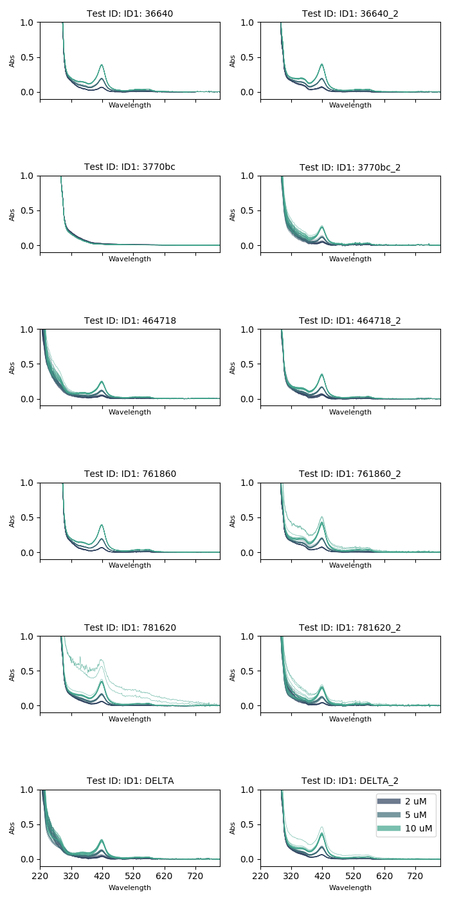

# README - Summary of README's

## 1 - Plate Selection

`1_PlateSelection/20190603_PlateSelectionAnalysis_subplotBrach.py`

## 2 - Serial Dilution Scheme

- Fixed:
    - [Protein]
    - [DMSO]
    - Well vol
    - N concs of substrate
- Free:
    - [Substrate]
    - Substrate type: 
        - Lauric Acid
        - NPG
    - Time 

> signs that spin shift occurs, may need re-analysis - some plots look like I've
> made a mistake

## 3 - Test Fatty Acids

- need to make images

## 4 - More Iterations

- Some good traces, no readmes, will need to dig up notes

## 5 - More Iterations

Arachadionic acid looks ok, 4-Phenylimidazole not great

## 6 - More Iterations

Bad stocks? Tried different platereaders, pipetting methods, still serial
dilutions I think.

## 7 - More

New stocks, lauric and palmitic acid just don't dissolve well 

Scattering, Protein precipitation and cold DMSO?

## 8 - Protein Concentrations

- Ligands: 
    - Arachadonic acid
    - Lauric acid
    - Palmitic acid
    - 4-Phenlyimidazole
- Protein Concentrations:
    - 3-5 μM -> 7.09 μM
    - 10 μM -> 14.09 μM
    - 20 μM -> 27.56 μM

## 9 Comparison to Titrations

- BM3 @ 15 μM
- Ligands:
    - Arachadonic acid
    - Lauric acid
    - Palmitic acid (caused issues)
    - 4-Phenylimidazole
- Manual dispensing?
- Only plate data
